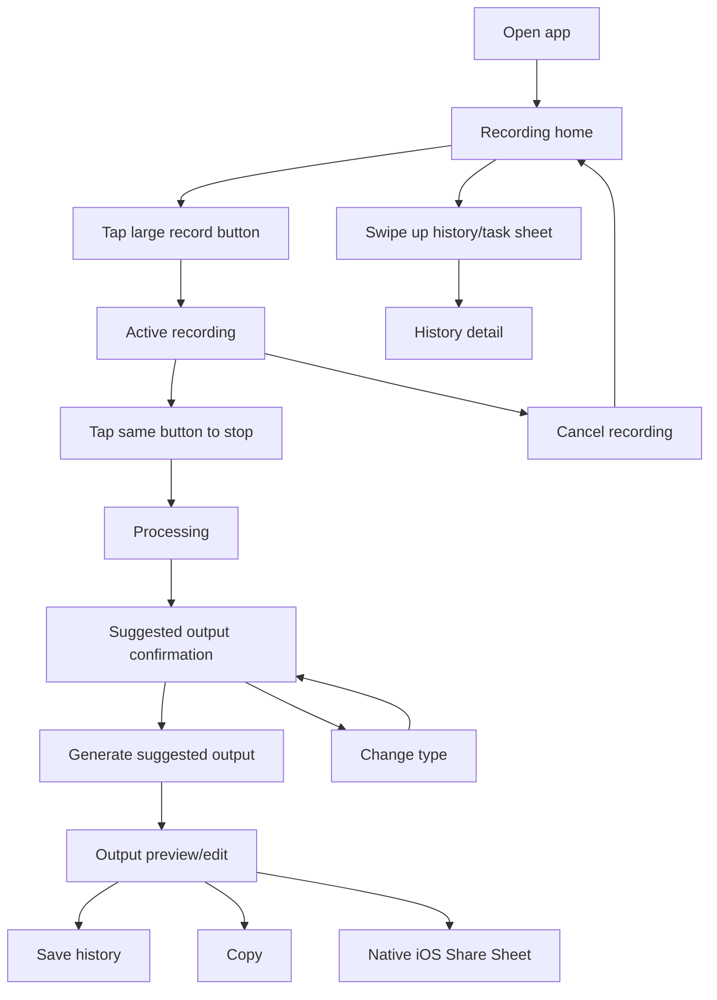

# AI Voice Notes To Content UX Flow

Last updated: 2026-05-24
Status: Draft v0.3
Figma design: https://www.figma.com/design/i2YJriFfE0abcoljVGF2uT

Design note: the Figma file should include an `Apple Native v3` page that copies the attached HIG-applied screen layouts, then applies Apple-native typography, SF Symbol references, Apple system colors, native sheets, and stable 44pt+ controls.

## 1. UX Philosophy

The app should feel like the fastest possible way to turn a thought into useful work.

The home screen is not a dashboard. It is a recording surface.

The user's first impression should be:

**Open. Tap. Speak. Trust that the work is done.**

Everything else, including history, settings, output type selection, editing, and export, should feel downstream from recording.

## 2. Core Interaction Rules

- The first visible interactive element on the home screen is one large record button.
- The same primary button starts and stops recording.
- No recording timer is shown anywhere in the core experience.
- Haptic and/or audio cues confirm recording start and stop by default.
- The recording state follows the attached reference: same centered record control becomes stop, with a secondary `Cancel` pill below.
- Top-right overflow uses an SF Symbol-style `ellipsis` control.
- History/task list is secondary and opens by swiping up from the recording home screen.
- Auto-start recording on app open is not the default. It is a future power-user setting.
- The user should never need to write a prompt.
- Output type selection happens after capture, not before.

## 3. Screen Map

MVP screens and surfaces:

- First-launch permission/onboarding surface
- Recording home
- Active recording state
- Processing state
- Suggested output confirmation
- Change output type sheet
- Output preview/edit
- Swipe-up history/task sheet
- History detail
- Native iOS Share Sheet
- Settings
- Error/retry states

## 4. First Launch Flow

Goal: get the user to the recording home with minimum friction.

Flow:

1. User opens the app.
2. App shows a short permission pre-prompt explaining microphone access in user-benefit language.
3. User continues.
4. iOS microphone permission request appears.
5. If granted, app opens the recording home.
6. If denied, app shows a recovery state with a Settings action.

UX requirements:

- Do not turn onboarding into a product tour.
- Do not lead with technical AI/cloud processing details.
- Keep copy short and practical.
- The first real product screen after permission is the recording home.

Suggested permission pre-prompt copy:

Title: `Voice in. Useful output out.`

Body: `Allow microphone access so you can capture a thought and turn it into a note, task list, email, journal entry, or post.`

Primary action: `Continue`

## 5. Recording Home

Purpose: make recording feel immediately available.

Layout:

- Top right: More toolbar button using SF Symbol `ellipsis`.
- Center: large record button.
- Bottom/edge: subtle swipe affordance for history, if needed.
- No dashboard cards.
- No prompt input.
- No output type picker.
- No visible recording timer.

Default copy:

- Prefer no helper text under the button.
- If testing shows text is needed, candidate labels are:
  - `Ready`
  - `Record`
  - `Hold that thought`
  - `Start`

Recommendation:

- Use a large icon-first record control with SF Symbol `mic.fill` in the default state and `stop.fill` in the active state.
- The record control's outer size, inner hit area, and center point must not change between start and stop states.
- Keep visible text minimal so the home screen feels confident, not instructional.

## 6. Active Recording State

Trigger: user taps the large record button.

Behavior:

1. App starts recording.
2. App gives haptic and/or audio start cue.
3. Primary button visually changes into stop state using `stop.fill`, while keeping the same frame and center point.
4. A secondary `Cancel` pill appears below the fixed centered stop control, matching the attached reference.
5. No timer appears.
6. User taps the same primary button to stop.
7. App gives haptic and/or audio stop cue.
8. App moves to processing.

Cancel behavior:

- `Cancel` discards the current recording.
- Apple platforms support a native cancel button role. In this design, `Cancel` is used as a secondary action in the temporary active-recording state. For a production build, discard confirmation can be added after a minimum recording duration if accidental loss appears in testing.
- Do not use a text `Back` button. Hierarchical screens use the standard chevron back control; modal/temporary screens may use leading `Cancel` or trailing `Done` depending on the task.
- After cancel, user returns to recording home.

State labels:

- Avoid timer-based feedback.
- Use visual state, button shape/color, subtle waveform/motion, or status text only if needed.

Possible status text while recording:

- `Recording`
- `Listening`
- No text, if the visual state is clear.

## 7. Processing State

Purpose: reassure the user that work is happening.

Flow:

1. Audio is prepared for transcription.
2. App transcribes.
3. App infers the best output type.
4. App shows suggested output confirmation.

UX requirements:

- Use neutral labels such as `Processing`, `Transcribing`, and `Generating`.
- Do not expose provider details.
- Do not show raw technical errors.
- If processing fails, preserve the recording when possible and offer retry.

Possible copy:

- `Turning this into something useful`
- `Cleaning it up`
- `Finding the best format`

## 8. Suggested Output Confirmation

Purpose: feel smart without trapping the user.

Flow:

1. App reviews transcript intent.
2. If user explicitly requested a format, app uses it.
3. If not explicit, app selects the best likely output type.
4. App shows one primary action and one secondary action.

Example:

- Primary: `Generate Email`
- Secondary: `Change Type`

Rules:

- Explicit intent wins. If the user says "write an email", suggest Email.
- If unclear, choose the best type but make it easy to change.
- Do not show all five output types as the first thing unless the user taps `Change Type`.

## 9. Change Output Type Sheet

Trigger: user taps `Change Type`.

Output options:

- Note
- Todo List
- Email
- Journal Entry
- Content Post

UX requirements:

- Use plain language.
- Keep the sheet short and easy to scan.
- Each option may include a tiny descriptor only if needed.
- Selecting a type returns to confirmation or immediately generates, depending on testing.

Recommended behavior:

- Selecting a type immediately updates the primary button, e.g. `Generate Todo List`.

## 10. Output Preview/Edit

Purpose: let the user trust, adjust, and send the result.

Layout:

- Title field.
- Generated body.
- Output type badge or subtle label.
- Primary actions: copy/share/save.
- Secondary action: regenerate/change type.

Requirements:

- Output must be editable before export.
- Edits are saved.
- User can copy the output.
- User can open native iOS Share Sheet.
- Share text should be Markdown-friendly for Notion and notes apps.

## 11. History/Task Sheet

Trigger: swipe up from recording home.

Purpose: let users recover and reuse past outputs without making history the app's identity.

Behavior:

- Swipe up reveals a secondary sheet/drawer.
- Sheet shows recent outputs.
- Each item shows title, output type, date, and short preview.
- Tapping an item opens history detail.
- Swipe down or drag closes the sheet.

UX requirements:

- History must never dominate the initial home screen.
- The record button remains the emotional center of the app.
- Search and tags are non-MVP unless needed after usage testing.

## 12. History Detail

Purpose: reopen, edit, share, copy, or delete a saved output.

Actions:

- Edit title/body.
- Copy.
- Share.
- Delete.
- Regenerate as another type if transcript is stored and available.

Open privacy question:

- Decide whether history stores raw transcripts, only generated outputs, or user-configurable transcript retention.

## 13. Settings

Access: top-right settings icon from recording home.

MVP settings:

- Audio retention explanation.
- Delete audio after transcription default.
- Usage/subscription status placeholder.
- Privacy/settings information.
- Support/about.

Future power-user setting:

- `Start recording when app opens`

Future related settings:

- Start recording only from widget/shortcut.
- Start cue preference.
- Stop cue preference.
- Save audio option.
- Local/private processing mode if available.

Settings should feel native:

- Simple grouped rows.
- Plain language labels.
- No marketing copy.
- No complex configuration before first use.

## 14. Error States

Permission denied:

- Explain that microphone access is required to record.
- Provide action to open iOS Settings.

Recording failed:

- Message: `Recording could not start. Try again.`
- Action: `Try Again`

Transcription failed:

- Message: `Could not transcribe this recording.`
- Actions: `Try Again`, `Cancel`

Generation failed:

- Message: `Could not create the output.`
- Actions: `Try Again`, `Change Type`

Share cancelled:

- No error needed.
- Return to output preview.

Usage limit reached:

- Show clear limit message.
- If subscriptions are enabled, show upgrade path.
- If subscriptions are not enabled, explain monthly limit.

## 15. Core Flow Summary

## 16. Design Notes For Figma

Updated Figma design should include these reference-faithful frames:

- Home.
- Active recording.
- Suggested output confirmation.
- Change type sheet.
- Output preview/edit.
- Swipe-up history sheet.
- Settings screen.

Visual direction:

- Premium, quiet, iOS-native.
- Minimal text.
- Strong central record control.
- No dashboard-first layout.
- No timer.
- No prompt box.
- Smooth sheet-based navigation.
- Current Apple-native interaction language: SF Pro Text/Display, SF Symbol references, Apple system background, Apple system red record control, black primary action pills, 24pt horizontal margins where shown in the reference, 44pt minimum hit targets, native sheets, standard chevron back, and subtle system material texture.
- Avoid custom emoji icons, shifting controls, handmade back glyphs, and boxed layouts that overlap safe areas.

## 17. Open UX Questions

- Should the record button remain icon-only, or should a short state label be shown above it for accessibility testing?
- Should start/stop use both haptic and audio cues by default, or haptic by default with audio cue optional?
- Should recording cancel require confirmation immediately, or only after a minimum recording duration?
- Should selecting an output type in `Change Type` immediately generate or return to confirmation?
- Should history sheet show generated outputs only, or also pending/failed recordings?
